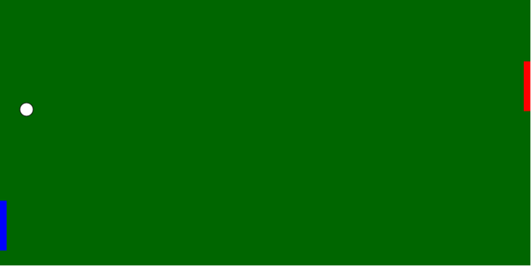

### 1. API Canvas

Esta página contém um código de exemplo da API Canvas.
O exemplo consiste em um jogo do estilo Pong.

### 2. Links do Exemplo

##### Slide 

Link: https://docs.google.com/presentation/d/1teAqimfsNgHbywE33J1YtQ2uo6fKjqmaex2kb9G32C0/edit?usp=sharing

##### Código

Link: https://fegemo.github.io/cefet-web-weblot/apis/canvas/

### 3. Créditos

- Gustavo Jordão Nunes
- Laís Ribeiro Matos Loureiro de Carvalho

##### Referências:

- http://www.w3schools.com/tags/ref_canvas.asp
- http://www.devmedia.com.br/html5-canvas-com-javascript/29866
- http://blog.mailson.org/2013/02/simple-pong-game-using-html5-and-canvas/

