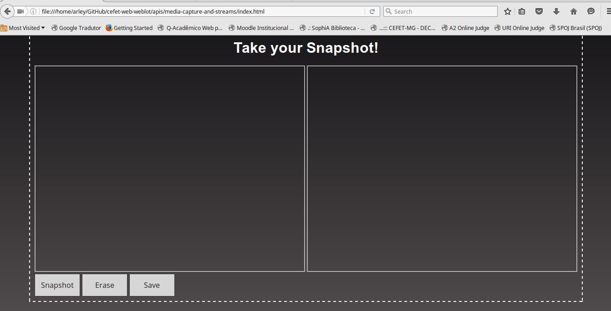

# _Media Capture and Streams API_

Exemplo de uso da Media Capture and Streams API para acesso a camera e microfone via web HTML5.

## Links do Exemplo

- Link para seminário: [slides da apresentaçao][slides]
- Link para exemplo publicado: [página no GitHub][vivo]

## Créditos

Este trabalho foi realizado em 2016/01 para a disciplina de Programação para Web do CEFET-MG no Campus II de Belo Horizonte.

Autor(es):

1. Arley Ribeiro  - 201322040362
2. Rafael Barbosa - 201412040094

[slides]: http://slides.com/arleyribeiro/deck/fullscreen
[vivo]: https://fegemo.github.io/cefet-web-weblot/apis/media-capture-and-streams/

## Referências

-[MDN - Mozilla Developer Network][page-mozilla]
-[MDN - Mozilla Developer Network - Media Streams][page-media]
-[HTML5 ROCKS][page-rocks]
-[DWB][page-dwb]
-[envatotuts+][page-tuts+]

[page-mozilla]: https://developer.mozilla.org/pt-BR/docs/Web/API/Navigator/getUserMedia
[page-media]: https://developer.mozilla.org/en-US/docs/Web/API/Media_Streams_API#LocalMediaStream
[page-rocks]: http://www.html5rocks.com/pt/tutorials/getusermedia/intro/
[page-dwb]: https://davidwalsh.name/browser-camera
[page-tuts+]: http://code.tutsplus.com/tutorials/getusermedia-using-the-media-capture-and-streams-api--cms-24784