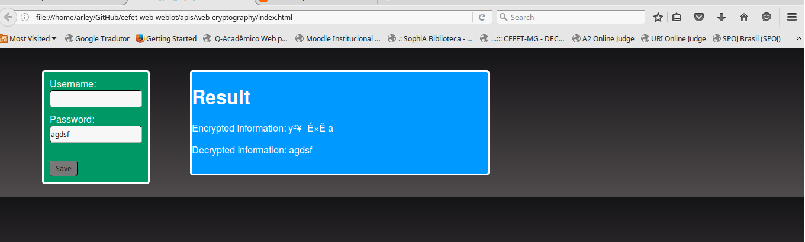

# _Web Cryptography API_

Exemplo de uso da Web Cryptography API para segurança na web HTML5.

## Links do Exemplo

- Link para seminário: [slides da apresentaçao][slides]
- Link para exemplo publicado: [página no GitHub][vivo]

## Créditos

Este trabalho foi realizado em 2016/01 para a disciplina de Programação para Web do CEFET-MG no Campus II de Belo Horizonte.

Autor(es):

1. Arley Ribeiro  - 201322040362
2. Rafael Barbosa - 201412040094

[slides]: http://slides.com/arleyribeiro/deck/fullscreen
[vivo]: https://fegemo.github.io/cefet-web-weblot/apis/web-cryptography/

## Referências

-[W3.org][page-w3]
-[QNimate][page-qnimate]
-[MDN - Mozilla Developer Network - Web Cryptography][page-webcryp]
-[Can I Use][page-caniuse]
-[envatotuts+][page-tuts+]

[page-w3]: https://www.w3.org/TR/WebCryptoAPI/
[page-qnimate]: http://qnimate.com/post-series/web-cryptography-api-tutorial/
[page-webcryp]: https://developer.mozilla.org/pt-BR/docs/Web/API/Window/crypto
[page-caniuse]: http://caniuse.com/#feat=cryptography