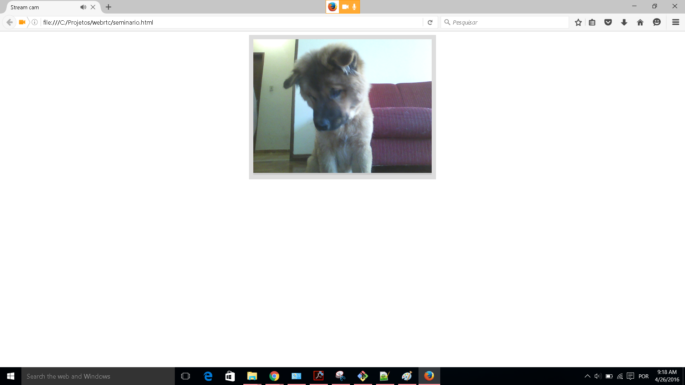

# WebRTC API 

API de comunicação de midia e arquivos ponto a ponto entre browsers

## Links do Exemplo

- Link para seminário: [slides apresentação][slides]
- Link para exemplo publicado: [repositorio][exgit]

## Créditos

Este trabalho foi realizado em 2016/01 para a disciplina de Programação para Web do CEFET-MG no Campus II de Belo Horizonte.

Autor(es):

1. Fernando Antônio Martins Vieira Júnior (201512040339)
2. Luan Tafarel 

Atribuições:

- WebRTC.org, criada por [webrtc.org][link1]

[slides]: https://docs.google.com/presentation/d/1ASAHwlZtE083E-jeXZNlO2W6k4YwM-C4ffnAYvZS6OU/edit?pref=2&pli=1#slide=id.g1261d728af_0_50
[exgit]: https://github.com/fernandoamvj/webrtc
[link1]: https://webrtc.org/
