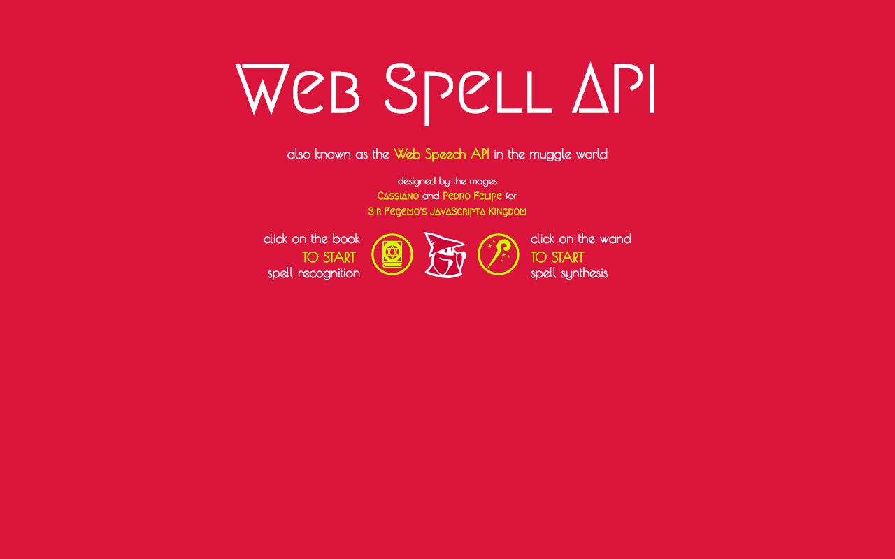

# _Web Speech API_

A _web speech API_ proporciona reconhecimento e síntese de fala (voz para texto e texto para voz, respectivamente) através das APIs de _Speech Recognition_ e _Speech Synthesis_, ambas desenvolvidas e publicadas pela Google em 2012.

## Links

- [Seminário][seminar]
- [Exemplo][example]

## Suporte

- _Speech Recognition API_: atualmente é suportada apenas pelos navegadores Chrome (v.47+), Chrome for Android (v.49) e Opera (v.36).
- _Speech Synthesis API_: suportada pelos navegadores Chrome (v.47+), Chrome for Android (v.49), Opera (v.36), Safari (v.9+) e iOS Safari (v.8.4+).
- Por enquanto, o _Recognition_ pode ser utilizado nos browsers com o prefixo `webkit`.
- O MS EDGE está implementando o suporte ao _Synthesis_, enquanto o _Recognition_ ainda está sob consideração. No Firefox, ambas podem ser habilitadas usando a _flag_ `media.webspeech.recognition.enable` e `media.webspeech.synth.enabled` para as respectivas APIs.

## Créditos

Trabalho realizado para a disciplina de Programação para Web ministrada pelo Prof. Flávio Coutinho (CEFET-MG, Engenharia da Computação).

*Autores*
- Cassiano de Brito Andrade
- Pedro Felipe Froes

*Atribuições*
- Slides construídos através do [Slides.com][source1]
- Fonte [Megrim][source2], por Daniel Johnson
- Fonte [Poiret One][source3], por Denis Masharov
- Ícones mágicos do site [ICONFINDER][source4]

*Referências*
- Especificação do _Web Speech API_ no [W3C][ref1]
- _Voice Driven Web Apps: Introduction to the Web Speech API_, no [Google Developers][ref2]
- _Web Apps That Talk: Introduction to the Speech Synthesis API_, no [Google Developers][ref3]

[seminar]: http://slides.com/pedrofelipefroes/web-speech-api/fullscreen
[example]: https://github.com/pedrofelipefroes/cefet-web-weblot/tree/2016/01/apis/web-speech-api
[source1]: https://slides.com
[source2]: https://www.google.com/fonts/specimen/Megrim
[source3]: https://www.google.com/fonts/specimen/Poiret+One
[source4]: https://www.iconfinder.com
[ref1]: https://dvcs.w3.org/hg/speech-api/raw-file/tip/speechapi.html
[ref2]: https://developers.google.com/web/updates/2013/01/Voice-Driven-Web-Apps-Introduction-to-the-Web-Speech-API?hl=en
[ref3]: https://developers.google.com/web/updates/2014/01/Web-apps-that-talk-Introduction-to-the-Speech-Synthesis-API?hl=en